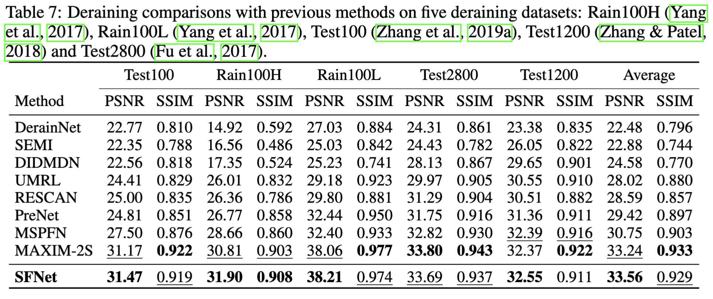
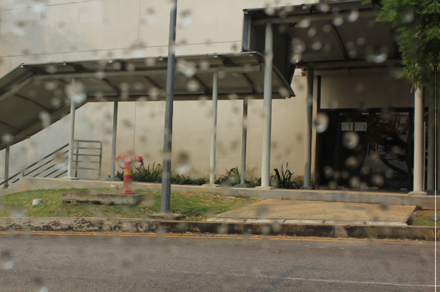

# Mức 2: Đánh giá mô hình deraining (pretrained) trên dữ liệu ngoài bài báo
**Ghi chú:** 
- **SFNet** là tên mô hình được công bố
- Đây là kết quả cho bộ dữ liệu từ bài báo [Attentive Generative Adversarial Network for Raindrop Removal from a Single Image (Rui Qian, Robby T. Tan, Wenhan Yang, Jiajun Su, Jiaying Liu)](https://arxiv.org/pdf/1711.10098)

## Kết quả trong paper
**Ghi chú:** Xem dòng **SFNet**

## Kết quả chạy thực nghiệm
/images/deraining_eval_muc_2.1_zoom_in.png)

/images/deraining_eval_muc_2.1.png)

## Đánh giá
$\implies$ **Kết quả chạy thực nghiệm trên bộ dữ liệu được sử dụng thấp hơn với số liệu paper, và không thể de-rain, do:**

- Dữ liệu có phân phối khác xa với dữ liệu paper (paper: ảnh mưa ảo, dữ liệu được sử dụng để thực nghiệm: ảnh mưa giống với thực tế)

Ảnh mưa từ dữ liệu thực nghiệm:

Ảnh mưa từ dữ liệu bài báo:

